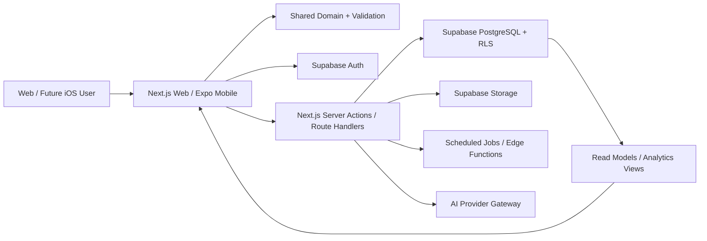
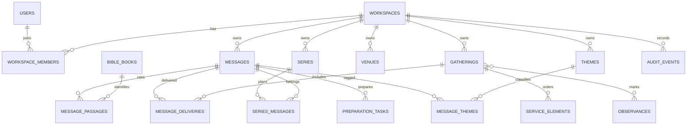
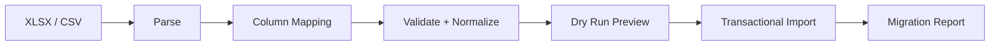

# Keryx Next 技術アーキテクチャ

更新日: 2026-06-11

## 1. アーキテクチャ方針

Keryx Next は、Web を最初の完成プロダクトとし、将来の iOS アプリとドメインロジックを共有できる TypeScript モノレポとして構築する。

### 推奨スタック

- Monorepo: `pnpm` workspaces + Turborepo
- Web: Next.js App Router + TypeScript strict
- Mobile: Expo + Expo Router（Phase 5）
- UI: Tailwind CSS + headless primitives + Keryx design tokens
- Database/Auth/Storage: Supabase
- Validation: Zod
- Forms: React Hook Form
- Unit/Integration: Vitest + Testing Library
- E2E: Playwright
- Database/RLS tests: pgTAP または Supabase test workflow
- Error monitoring: Sentry 相当
- Product analytics: プライバシーに配慮したイベント計測

### 採用理由

- Next.js App Router により、認証済みデータ取得、Server Actions、Route Handlers、ストリーミング UI を一貫して扱える。
- Supabase は PostgreSQL、Auth、Storage、RLS を統合し、現行プロトタイプの資産を活用できる。
- Expo Router は将来の iOS でファイルベースルーティングと deep link を提供する。
- 共有パッケージにドメイン型・Passage parser・validation・design tokens を置くことで、Web と mobile の挙動差を抑える。

## 2. 現行プロトタイプの扱い

現行 `/Users/james/keryx` は、プロダクト仮説と UI パターンの参照実装として価値がある。ただし、本番版へそのまま積み増さない。

### 再利用候補

- Supabase Auth と課金フローの知見
- モバイル下部ナビゲーションとデスクトップサイドバーの方向性
- ホーム、カレンダー、Inbox、アーカイブの基本導線
- 温かいオフホワイト、藍色、金色のデザイントークン
- シリーズ、AI、Markdown export のプロトタイプ

### 移行前に正す問題

- JavaScript から TypeScript strict へ移行する。
- `sermons` 一枚テーブル中心のモデルを Message / Gathering / Service Element へ分割する。
- `church`、`date`、`call_to_worship`、`response_hymn` を Message 属性から外す。
- AI API キーと AI 呼び出しをクライアントから排除する。
- UI 内の仮データ、英語の未翻訳、未接続コンポーネントを整理する。
- RLS policy と migration をリポジトリで管理する。
- テスト、監視、エラー境界、インポート処理を追加する。

## 3. 推奨リポジトリ構成

```text
keryx/
├── apps/
│   ├── web/                    # Next.js App Router
│   └── mobile/                 # Expo Router、Phase 5で追加
├── packages/
│   ├── domain/                 # エンティティ型、Zod schema、ユースケース
│   ├── scripture/              # 書巻マスタ、Passage parser、canon metadata
│   ├── ui/                     # 共有可能なUI primitivesとtokens
│   ├── database/               # generated types、query helpers
│   ├── analytics/              # 集計定義、純粋関数
│   └── config/                 # eslint、typescript、tailwind
├── supabase/
│   ├── migrations/
│   ├── seed.sql
│   ├── tests/
│   └── functions/
├── docs/
│   ├── product/
│   ├── ai/
│   └── adr/
├── CLAUDE.md
└── pnpm-workspace.yaml
```

## 4. システム構成



### 境界ルール

- ブラウザからの単純なユーザー所有データ操作は、RLS を前提に Supabase client を使用できる。
- 課金、AI、インポート、管理操作、複数テーブルの重要更新はサーバー境界を通す。
- service role key はサーバー専用であり、通常のユーザー操作の認可代替に使わない。
- ドメインロジックは React component や SQL view に散らさず、共有パッケージまたは明示的な DB function に置く。

## 5. データモデル

### 5.1 ER 概要



### 5.2 共通列

Workspace 配下の主要テーブルは原則として次を持つ。

- `id uuid primary key default gen_random_uuid()`
- `workspace_id uuid not null`
- `created_at timestamptz not null default now()`
- `updated_at timestamptz not null default now()`
- `created_by uuid`
- `updated_by uuid`
- `deleted_at timestamptz null`
- `version integer not null default 1`

人間向け ID は UUID と分離し、例として `MSG-2026-0042` を生成する。正規の参照には UUID を使う。

### 5.3 主要テーブル

#### `workspaces`

- `name`
- `slug`
- `timezone`
- `locale`
- `denomination_preset`
- `settings jsonb`

#### `workspace_members`

- `workspace_id`
- `user_id`
- `role`: `owner | pastor | planner | viewer`
- `status`

#### `messages`

- `display_id`
- `type`: `sermon | prayer_meeting_exhortation | devotional | lecture | other`
- `title`
- `central_message`
- `summary`
- `outline_markdown`
- `notes_markdown`
- `status`: `inbox | planned | preparing | ready | completed | archived`
- `primary_series_id nullable`
- `source_links jsonb`
- `metadata jsonb`

日付、Venue、説教者、礼拝順序は保存しない。

#### `gatherings`

- `display_id`
- `title`
- `kind`: `sunday_worship | prayer_meeting | special_service | chapel | other`
- `starts_at`
- `ends_at`
- `timezone`
- `venue_id`
- `status`: `draft | scheduled | completed | canceled`
- `audience`
- `notes`

#### `message_deliveries`

- `message_id`
- `gathering_id`
- `speaker_member_id nullable`
- `speaker_name`
- `position`
- `delivery_notes`

初期版は Gathering あたり一つの主要 Message を想定してよいが、DB は複数を許容する。

#### `service_elements`

- `gathering_id`
- `position numeric`
- `type`: `call_to_worship | hymn | prayer | responsive_reading | scripture_reading | message | offering | ceremony | doxology | benediction | custom`
- `title`
- `content`
- `reference`
- `assignee`
- `duration_minutes`
- `metadata jsonb`

`metadata` の例:

```json
{
  "hymn_number": "讃美歌21 493",
  "ceremony_type": "communion",
  "visibility": "public"
}
```

#### `message_passages`

- `message_id`
- `role`: `primary | supporting`
- `position`
- `book_id`
- `start_chapter`
- `start_verse nullable`
- `end_chapter`
- `end_verse nullable`
- `display_text`

#### `bible_books`

- `osis`
- `canonical_order`
- `testament`: `old | new`
- `genre`
- `name_ja`
- `short_name_ja`
- `name_en`
- `aliases jsonb`
- `chapter_verse_counts jsonb`

新約ジャンル名は `公同書簡` を使用する。

#### `series`

- `name`
- `description`
- `color`
- `starts_on`
- `ends_on`
- `status`
- `primary_book_id nullable`
- `goal`

#### `series_messages`

- `series_id`
- `message_id`
- `position`
- `planned_passage_text`
- `notes`

#### `preparation_templates` / `preparation_template_items`

- Workspace と Message type ごとの準備工程テンプレート。
- 各 item は `title`、`position`、既定期限オフセットを持つ。

#### `preparation_tasks`

- `message_id`
- `template_item_id nullable`
- `title`
- `status`: `todo | doing | done | skipped`
- `due_at`
- `completed_at`
- `notes`
- `position`

#### `observances`

- `name`
- `kind`
- `starts_on`
- `ends_on`
- `color`
- `source`: `preset | workspace`
- `metadata jsonb`

#### `audit_events`

- `workspace_id`
- `actor_id`
- `entity_type`
- `entity_id`
- `action`
- `summary`
- `changed_fields jsonb`
- `created_at`

機密本文全体を audit log に複製しない。

## 6. RLS と認可

### 原則

- 公開スキーマの全テーブルで RLS を有効にする。
- ユーザーは `workspace_members` に active membership がある Workspace のデータだけを閲覧できる。
- 書き込みは role ごとに制御する。
- Owner は Workspace 設定とメンバーを管理できる。
- Pastor は Message の非公開内容を管理できる。
- Planner は Gathering と Service Element を管理できるが、非公開 Message notes は既定で閲覧不可とする。
- Viewer は明示的に共有された範囲のみ閲覧できる。

### 必須 RLS テスト

1. Workspace A のユーザーは Workspace B の行を select できない。
2. Workspace A のユーザーは B の ID を指定して update/delete できない。
3. Planner は許可されていない Message notes を閲覧できない。
4. Viewer は write できない。
5. membership 削除後は即座にアクセス不能になる。

## 7. Scripture パーサー

`packages/scripture` に純粋関数として実装し、Web と mobile で共有する。

### 入力例

- `ヨハネ3:16`
- `ヨハ 3:16-21`
- `ヨハネの福音書 3章16〜21節`
- `John 3:16-21`
- `詩篇 23`
- `Ⅰコリント13:1-13`

### 出力例

```ts
type PassageRange = {
  bookId: string;
  startChapter: number;
  startVerse?: number;
  endChapter: number;
  endVerse?: number;
  displayText: string;
};
```

### 品質条件

- 表記揺れは alias table で解決し、巨大な正規表現一つに依存しない。
- chapter/verse count で範囲検証する。
- 解析不能な入力を勝手に補完せず、修正候補を返す。
- parser はデータベースや UI に依存しない。

## 8. 読み取りモデルと分析

分析画面で巨大なクライアント集計を行わない。SQL view、materialized view、または期間指定 RPC を使う。

### 初期 read models

- `upcoming_gatherings_view`
- `message_preparation_progress_view`
- `passage_usage_view`
- `annual_message_balance_view`
- `workspace_activity_view`

### 集計ルール

- Message 数と Delivery 数を混同しない。
- 同じ Message を複数回語った場合、説教内容の分析は Message 単位、実施回数の分析は Delivery 単位と明記する。
- グラフには必ず期間、フィルター、母数を表示する。

## 9. Web アプリ境界

### App Router 例

```text
apps/web/app/
├── (public)/
│   ├── login/
│   └── pricing/
├── (app)/
│   └── [workspaceSlug]/
│       ├── page.tsx
│       ├── calendar/
│       ├── messages/
│       ├── gatherings/
│       ├── series/
│       ├── analytics/
│       └── settings/
└── api/
    ├── imports/
    ├── exports/
    └── ai/
```

### データ取得

- Server Component で初期表示に必要な read model を取得する。
- ユーザー操作は Server Action または Route Handler を使い、Zod で入力検証する。
- 楽観的更新は、失敗時に確実に復元・通知できる操作だけで使う。
- URL に期間、フィルター、選択中 ID を可能な範囲で保持する。

## 10. AI アーキテクチャ

- AI provider への直接ブラウザアクセスは禁止する。
- サーバー側 gateway で model、費用、レート、タイムアウト、監査を管理する。
- Workspace ごとに AI 利用可否と月次上限を設定する。
- 入力データを最小化し、機密ノート送信前に明示的同意を得る。
- 構造化出力を Zod で検証する。
- 提案は `ai_suggestions` として一時保存し、承認操作後に正本へ反映する。
- prompt と model version を監査可能にするが、秘密情報は保存しない。

## 11. Spreadsheet 移行

### 移行パイプライン



### ルール

- 元ファイルは変更しない。
- 行ごとに `source_row_number` と fingerprint を持ち、再実行時の重複を防ぐ。
- 旧1行を、原則 `Message + Gathering + Service Elements` へ分割する。
- 空の J 列など、表示不要・不要列は列マッピングで無視できる。
- 元 ID は `legacy_id` として保持できるが、新 ID は自動発行する。
- 招詞、開会賛美、交読、応答賛美、式典、頌栄を Service Element に変換する。
- 変換できない内容は破棄せず、`migration_notes` に残す。

## 12. テスト戦略

### Unit

- Passage parser
- ID 表示生成
- Preparation progress
- liturgical date calculation
- import normalization
- analytics aggregation

### Integration

- Server Action と Supabase
- Message + Gathering のトランザクション
- Service Element reorder
- import dry run / retry
- AI suggestion approval

### E2E

1. 新規登録から最初の Message/Gathering 作成
2. 礼拝テンプレート適用、賛美追加、並べ替え
3. カレンダー移動とダッシュボード反映
4. Spreadsheet インポート
5. エクスポート
6. Workspace 間アクセス遮断

### アクセシビリティ

- axe による主要画面検査
- キーボードのみの Quick Add と Service Element 並べ替え
- 日本語 IME 中のフォーム送信防止

## 13. 監視と運用

- エラー監視に request ID、workspace ID のハッシュ、操作名を含める。
- 本文・API key・token はログに含めない。
- migration、RLS、Edge Function を CI で検証する。
- 本番 DB の直接変更は禁止し、migration を正本とする。
- 定期バックアップ、復元訓練、インシデント手順を用意する。

## 14. ADR が必要な判断

以下は実装前に `docs/adr/` へ記録する。

1. 現行 Vite アプリを段階移行するか、新しい monorepo に移して route 単位で置換するか。
2. Rich text を初期版に含めるか、Markdown に限定するか。
3. Workspace role と Message privacy の詳細。
4. 教会暦 calculation library / data source。
5. PWA offline の対象範囲。
6. AI provider gateway と課金単位。
